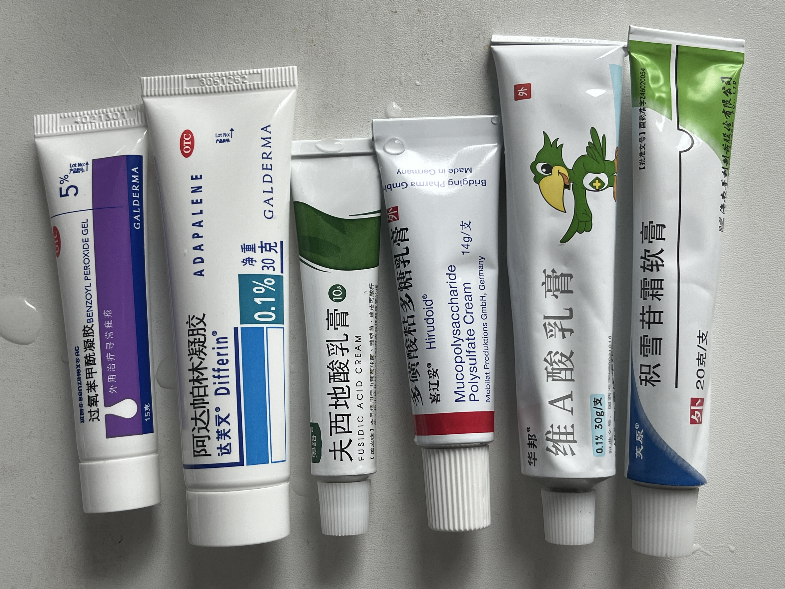

# 教你如何去除痘痘（痤疮），去除痘印（红色痘印，黑色痘印）

## 本文对读者的价值
列出处理痘痘的常见药物，推荐视频，帮助读者去除痘痘（痤疮）和痘印（红色痘印，黑色痘印）让皮肤平整白净

## 处理痤疮的常见药物
1. 阿达帕林凝胶：只能晚上用，因为有光敏性，白天不要用。维A酸类药物，属于第三代维 A 酸。
1. 过氧苯甲酰凝胶：可以白天用
1. 夫西地酸乳膏
1. 积雪苷霜软膏
1. 维 A 酸乳膏
1. 多磺酸粘多糖乳膏
1. 人表皮生长因子凝胶
1. 壬二酸凝胶
1. 复方熊果苷乳膏
1. 甲硝唑凝胶
1. 异维A酸红霉素凝胶

请读者自行搜索（抖音或 B 站等）获取详细药物信息。

## 推荐视频（如果只看一个视频就看这个）
- [中国痤疮诊疗指南：祛痘外用药保姆级教学](https://www.bilibili.com/video/BV1Ei4y1r7rX/)：视频时长 5 分 29 秒，参考了 中国痤疮治疗指南（2019 修订版） 和 寻常痤疮基层诊疗指南（2023 年）

## 其他视频
说明：以下视频我没有全部仔细看完，部分视频只看了大概。

- [权威护肤｜详解【中国痤疮指南】](bilibili.com/video/BV1BT411B7tZ/)
- [祛痘药咱按着指南来，《中国痤疮治疗指南》痘痘外用药物解读，再也不用头疼网红药物分不清了](https://www.bilibili.com/video/BV1XY411K7fp)
- [【硬核科普】红痘印┇痤疮后红斑┇18种治疗的文献总结](https://www.bilibili.com/video/BV1DW421A7xD)
- [⚡7分钟 49+种美白方法大盘点⚡痘印色沉色斑淡化黑色素的通用总论知识](bilibili.com/video/BV1Lx421Q7f5/)
- [纳尼？！痘印居然可以消失的这么干净？《如何治疗痘印》](bilibili.com/video/BV1Qm421x7PV)

## 注意事项
- 面部防晒（帽子，雨伞，防晒霜等），要晒就晒手臂，腿，胸，背等
- 牛奶会促进长痘（相关细节请自行搜索）不管是全脂牛奶，脱脂牛奶，含奶的咖啡，奶茶，乳制品，可以全部不吃，观察痘痘是否有改善
- 控糖，减少糖分摄入，不要再喝任何饮料
- "过氧苯甲酰" 和 "维 A 酸乳膏" 不要同时使用（同时涂抹在一个痘痘上）

## 阿达帕林凝胶
#### 阿达帕林 适用症状
- 闭口粉刺（位于额头和下巴部位）
- 鼻子上的黑头
- 毛孔粗大
- 痘痘

#### 阿达帕林 注意事项
- 有光敏性，不可以白天使用，请在晚上使用，（家里灯光和屏幕灯光没事）
- 过敏测试：耳后涂一点，等待 5-10 分钟，如果没有刺痛发红再使用。
- 涂抹方法：点涂，薄涂，不能全脸大面积涂（随着建立耐受才可以逐渐增大面积）
- 建立耐受的意思是：第一次停留 5 分钟后用清水洗去，然后 30 分钟，1 小时，2 小时，最后过夜，第二天用清水洗去，建立耐受后才可以大面积涂
- 干痒脱皮泛红是常见的，逐渐建立耐受，记得补水保湿

## 积雪苷霜软膏
- 用于红色痘印（皮肤是平滑的才是痘印）点抹在红色痘印区域，按摩 2 分钟吸收，
- 每天涂抹 3-4 次
- 只对痘印有效果，对痘痘没效果，不要涂抹在痘痘上
- 陈年红印可以用"喜辽妥 多磺酸粘多糖乳膏"
- 它不适用于黑色痘印
- 不要大面积涂抹，只涂抹在痘印上，痘印是手指头摸上去感觉平整的。痘痘是摸起来凸出来
- 三种浓度：2.5%，2.75%，24%

## 参考资料
- [过氧苯甲酰到底是什么？](http://www.pumcderm.net/list/174/697.html)

  
<h3>《协和肖医生写给大家的医美指南》书中内容（点击展开）</h3>

刷酸，以前叫果酸换肤。
利用中高浓度的酸性凝胶腐蚀掉表面的角质层。
不限于果酸，水杨酸，壬二酸，维 A 酸等等。

果酸：医用浓度是 20%～70%，家用护肤品的浓度是  5% 左右。
果酸就是单纯的化学剥脱，没有什么副作用。

水杨酸：医用浓度  10%～20%，家用浓度是  0.5%～2%。
剥脱效果稍微弱一点，不如果酸，
好处是有一定抗炎效果，如果长红色痘痘，水杨酸的效果比果酸好。

壬二酸：医用浓度 10%～30%，家用护肤品中比较少见。
主要用于脸上角质层比较厚的地方。
缺点是用完之后，皮肤灼烧刺痒的感觉比较明显。

根据皮肤的状况和位置的不同，所用酸的浓度也不同，
面部一般  20%～30% 的浓度，眼睑不适合刷酸，皮肤很薄。
如果后背皮肤特别厚的痘痘和闭口，浓度  70%。

多久做一次医美刷酸？间隔一个月。
如果以后规律进行，两周一次比较合理，最频繁也不要一周一次。
不建议同时用医美刷酸和家用含酸护肤品。
大于等于 2 次刷酸如果皮肤变得更糟糕或者敏感，及时停止，并且去皮肤科门诊就诊。

### 无论医美刷酸还是日常酸性护肤品
原理完全相同，区别是酸的类别和浓度。
一定要在有资质的医疗机构，用医用级别的果酸，水杨酸或者壬二酸。
无论任何浓度的维 A 酸，都必须经过皮肤科医生开处方。

## 免责声明
本文作者不是医生，本文仅供参考，不构成专业医疗建议。请咨询专业医生或皮肤科医生以获得个性化指导。作者不对因使用本文内容而产生的任何后果负责

## 写这篇文章的原因
作者自己需要处理痤疮（痘痘）问题，所以把了解到的信息简单罗列一下，    
本文会保持尽可能的短，因为大量优秀内容已经有抖音和 B 站视频了，读者看视频就行了，不需要读无聊的长文。    
作者不了解"激光"和"微针"疗法，因此本文无相关信息。   

## 我的最终方案（仅供参考，不一定适合你）
我的痤疮是一级和二级，痘痘数量少，面积小。  
早上：**过氧化苯甲酰**，点涂痘痘。  
晚上：**阿达帕林凝胶**，涂抹鼻头（去黑头），涂抹鼻翼两侧（缩小毛孔）点涂痘痘。    

针对红色痘印，阿达帕林凝胶可以解决，但是白天用不了阿达帕林，所以白天用**积雪苷霜软膏**，一天可涂抹 3-4 次。
视频里说：连续使用 4 到 8 周开始起效, 3 个月后有明显效果（需要搭配生活饮食习惯）  
在痘痘康复后，也要坚持涂 3 到 12 个月。  

多磺酸粘多糖乳膏 买了还没到货，对红痘印也有效果，打算和 **积雪苷霜软膏** 交替使用试一试，或者长期用一个，不行了就换另一个。  

## 皮肤相关视频创作者
列表不全，我只是随手收集一下，排名随机。   

- 皮科医生魏小博: [B站](https://space.bilibili.com/456404164/upload/video)
- 叶小戳的护肤笔记: [B站](https://space.bilibili.com/1223664358/upload/video)
- 人类面子工程队: [B站](https://space.bilibili.com/22043723/upload/video)
- 冰寒哥: [B站](https://space.bilibili.com/37889997/upload/video)
- 皮肤科的王医生: [B站](https://space.bilibili.com/4390920/upload/video)
